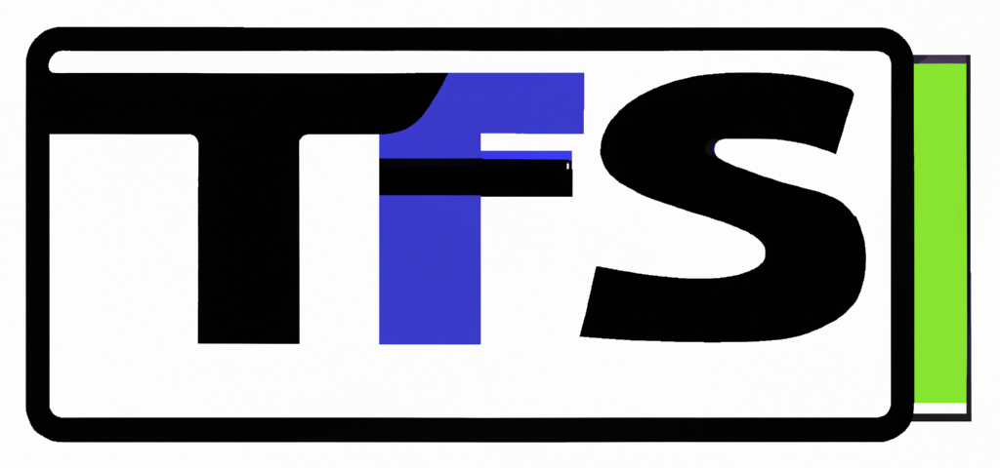

TegFS is a virtual file system that utilizes a tag-based system for file organization,
categorization and searching.
It provides an alternative to classical directory-based file organization
and cloud-based solutions, such as Nextcloud and Google Drive.
TegFS is built with a focus on simplicity, security and performance,
making it an efficient and user-friendly solution for personal and professional file management.

Similar to Nextcloud,
TegFS allows users to have full control over their data and the way it is organized.
But TegFS does not do as much, so unlike Nextcloud, it is simpler and more lightweight,
making it easy to use and set up.
It also shares similarities with Hydrus,
another tag-based file manager,
but TegFS is designed to be even more intuitive and user-friendly,
while providing more actual features.

With TegFS, you can easily categorize and locate your files by tagging them,
and searching for them later.
It also provides advanced sharing capabilities, making it perfect for anyone who wants to keep their files organized and accessible.
Plus, it's completely free and libre software, so everyone can use and contribute to it.

Whether you prefer working on the command line or through a user-friendly interface, TegFS has got you covered.
TegFS offers a featureful CLI for power users, and a web-based UI for easy access and file management.

# Dependencies

- Main program
  - `GNU guile` version >1.8 for running the main program (MUST HAVE)
  - `wget` for saving stuff from the internet
  - `xclip` for dumping clipboard content
  - `file` for determining file types
  - `fzf` for making choices during `tegfs save` (MUST HAVE)
  - `rsync` and `ssh` for sending files to remote servers if using `tegfs save` with `--remote`
  - `prolog` for `tegfs prolog` command
- Web server
  - `ffmpeg` for video previews production
  - `imagemagick` for image previews production
  - `entr` for checking if new previews need to be made (MUST HAVE)
  - third-party file server, such as `Nginx`, if using `--offload-filesharing` option for `tegfs serve`
  - `xdg-open` if not using `--offload-filesharing` option for `tegfs serve`
  - [pup](https://github.com/ericchiang/pup) for generating weblink thumbnails

# Note on query

Along with usual tags,
 query provides special tags that are auto generated.
The tags are:

- `%any` - true for all arguments (arity = 1)
- `%diff` - true if two objects are different (arity = 2)
- `%remote` - true if target is a web link (arity = 1)
- `%local` - true if target is not a web link (arity = 1)
- `%notarget` - true if the object has no target (arity = 1)
- `%unsorted` - true if the object has no other user-defined tags (arity = 1)
- `%upload` - true if the object was uploaded through the web interface (arity = 1)

So, for example, doing `tegfs query %any` will return
 every object there is in the database.
