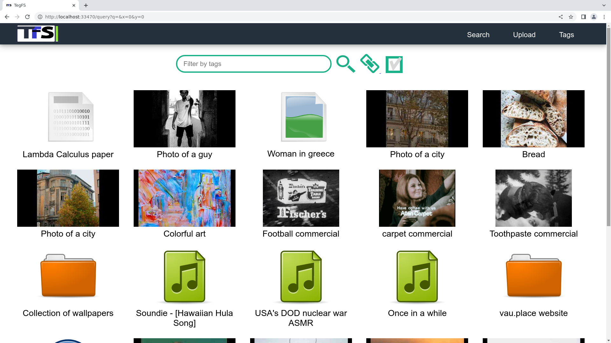

Demo
============

To get a better idea of how TegFS works, you can run a demo and test the file system.

First, navigate to the TegFS directory and run the following command:

.. code-block:: bash

   sh test/test-serve-noauth.sh

This command starts a local TegFS server that you can access at ``http://localhost:33470``

When the server starts, you should see the TegFS welcome page. Click the "here" button to proceed.

Then press enter.
This will take you to the TegFS file browser page, where you can view and manage your files.

Now you can test how TegFS looks and works. You can add, delete, and manage your files using the TegFS file browser.

Command line interface
++++++++++++++++++++++

The command line interface (CLI) is the primary way of interacting with TegFS. It provides a powerful and flexible way to manage files and directories, organize them with tags, and perform complex queries to find the content you need. Let's explore some of the features of the TegFS CLI.

First, let's make sure we are working on the test database by issuing the following command:

.. code-block:: bash

   cd tegfs
   make test-files
   export TEGFS_ROOT="$PWD/dist/exampleroot"

This sets the root of the TegFS database to the dist/exampleroot directory relative to the current working directory.

Now, let's generate some data for testing. In the terminal, type the following commands:

.. code-block:: bash

   echo file content > file1.txt
   man man > file2.txt

Next, we will add these files into the TegFS database. In the terminal, type the following commands:

.. code-block:: bash

   tegfs add --content file1.txt --tag text --tag testing --tag small
   tegfs add --content file2.txt --tag text --tag testing --tag big

The ``tegfs add`` command adds files to the TegFS database. In this example, we are adding ``file1.txt`` and ``file2.txt`` with tags **text**, **testing**, **small**, and **big**.

We can now search for files using queries:

.. raw:: html

   <pre class="command-line language-bash" data-user="chris" data-host="localhost" data-filter-output=">" tabindex="0"><code class="language-bash">tegfs query text testing
   ((tags text testing small)
    (target . "8h/file1.txt")
    (id . "neidahutmnqjwhd83p2xcfn8rv7qkf")
    (date . "2023-05-15T22:52:28+0000"))
   
   ((tags text testing big)
    (target . "q1/file2.txt")
    (id . "8dnsoawapkn136znuzogkudim1selj")
    (date . "2023-05-15T22:52:54+0000"))
   
   Total of 2 matches.
   
   tegfs query small testing
   ((tags text testing small)
    (target . "8h/file1.txt")
    (id . "neidahutmnqjwhd83p2xcfn8rv7qkf")
    (date . "2023-05-15T22:52:28+0000"))
   
   Total of 1 matches.</code></pre>

The tegfs query command searches for files in the TegFS database that match the specified criteria. In this example, we are searching for files with the tags "text" and "small", and "text" respectively.

We can also print the contents of a database file by addressing it by its entries' id:

.. raw:: html

   <pre class="command-line language-bash" data-user="chris" data-host="localhost" data-filter-output=">" tabindex="0"><code class="language-bash">tegfs print "neidahutmnqjwhd83p2xcfn8rv7qkf"
   file content</code></pre>

The newly added files are also visible in the web interface:

Unlike the web interface, the command line interface to TegFS is complex, it has lots of options, and it is designed to be used in scripting.
So it can be a bit intimidating at first, especially if you are not familiar with the terminal.
However, with a bit of practice, you will soon become comfortable using it and will appreciate the power and flexibility it provides.
