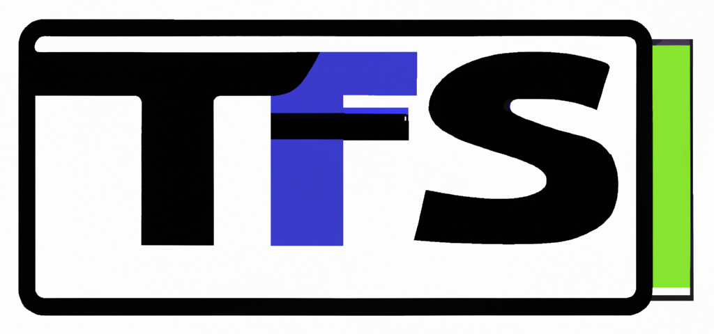

Welcome to TegFS documentation!
=================================

TegFS is a virtual file system that utilizes a tag-based system for file organization,
categorization and searching.
It provides an alternative to classical directory-based file organization
and cloud-based solutions, such as Nextcloud and Google Drive.
TegFS is built with a focus on simplicity, security and performance,
making it an efficient and user-friendly solution for personal and professional file management.

Similar to Nextcloud,
TegFS allows users to have full control over their data and the way it is organized.
But TegFS does not do as much, so unlike Nextcloud, it is simpler and more lightweight,
making it easy to use and set up.
It also shares similarities with Hydrus,
another tag-based file manager,
but TegFS is designed to be even more intuitive and user-friendly,
while providing more actual features.

With TegFS, you can easily categorize and locate your files by tagging them,
and searching for them later.
It also provides advanced sharing capabilities, making it perfect for anyone who wants to keep their files organized and accessible.
Plus, it's completely free and libre software, so everyone can use and contribute to it.

Whether you prefer working on the command line or through a user-friendly interface, TegFS has got you covered.
TegFS offers a featureful CLI for power users, and a web-based UI for easy access and file management.

Join TegFS development on `Codeberg <https://codeberg.org/otto/tegfs>`_.

Installation
------------

To install TegFS, please follow the instructions provided in the :doc:`installation` page.

Contents
==================

.. toctree::
   :maxdepth: 1

   installation
   demo
   query
